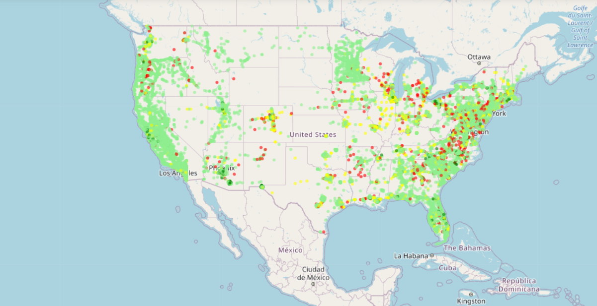

Keywords: ML, classification, geo-data, visualization

# Vision Zero in USA

According to World Health Organization approximately 1.35 million people die each year in car accidents all over the world. There are multiple risk factors that increase the chance of car accident and level of its severity, for instance, speeding, distracted driving, unsafe vehicles, alcohol and so on. Significant part of these factors assume that the whole responsibility for road safety lies with road users and cars manufacturers.

In the 90's Sweden designed and adopted Vision Zero as a long-term strategy to increase road safety and reduce to zero lethal car accidents. The revolutionary idea of Vision Zero is to share responsibility for road safety between people using roads and people designing them. Systematic approach of Vision Zero enables to create a safe mobility system forgiving of human error that guarantees everyone's right to move safely in their communitie. **By now thanks to systematic implementation of Vision Zero principles Sweden possesses the best road safety record in the EU.**
​

**Simply saying, Vision Zero admits that people make mistakes, they are unavoidable and we should design such roads and regulations to ensure that human mistakes on the roads will never result in traffic-related fatalities and serious injuries.**

Vision Zero is more than a program or safety concept. It's an ethical approach that assumes: ["It can never be ethically acceptable that people are killed or seriously injured when moving within the road transport system."](https://www.monash.edu/muarc/archive/our-publications/papers/visionzero) It is not right that traffic deaths are considered to be inevitable side effects of modern world. 

 
Since Sweden became a pioneer, multiple countries and cities across the globe have implemented principles of Vision Zero. Since 2014 several US cities have started adopting Vision Zero, for instance, Boston, Los Angeles, Seattle and couple of states, for instance, Maryland. Also, there are states that plan to adopt Vision Zero and run public campaigns coverig problems of low road safety. 

​

**The goals of this project are following:**

- to analyse car accidents in the USA, particularly in California, to evaluate if there is any progress in the last 5-6 years;

- to analyse cases of fatal car accidents in the cities with changes performed by cities' administrations;

- to create a model that predicts if a car accident results in death or serious injury.

​

# DATA

In this project I use mainly 2 impressive datasets with information about car accidents in the USA. These datasets provide slightly different sets of details about each crash, so, I use them both for analysing presence and effectiveness of various designing principles.

1. **A Countrywide Traffic Accident Dataset (2016 - 2020, 49 states of the USA), 2.9 million records.** The dataset was provdied by Sobhan Moosavi on [Kaggle.com](https://www.kaggle.com/sobhanmoosavi/us-accidents) (Licence CC BY-NC-SA 4.0). The dataset was originally published in the following articles:

- Moosavi, Sobhan, Mohammad Hossein Samavatian, Srinivasan Parthasarathy, and Rajiv Ramnath. [“A Countrywide Traffic Accident Dataset.”](https://arxiv.org/abs/1906.05409), arXiv preprint arXiv:1906.05409 (2019).

- Moosavi, Sobhan, Mohammad Hossein Samavatian, Srinivasan Parthasarathy, Radu Teodorescu, and Rajiv Ramnath. [“Accident Risk Prediction based on Heterogeneous Sparse Data: New Dataset and Insights.”](https://arxiv.org/abs/1909.09638) In proceedings of the 27th ACM SIGSPATIAL International Conference on Advances in Geographic Information Systems, ACM, 2019.

2. **California Traffic Collision Data from SWITRS (2001 - 2020), 9.17 million records.** The dataset was provided by Alex Gude on [Kaggle.com](https://www.kaggle.com/alexgude/california-traffic-collision-data-from-switrs) (Licence CC0 1.0). The data about collisions was requested from the California Highway Patrol and combined by the author. Detailed data dictionary for the dataset can be found [here](https://tims.berkeley.edu/help/SWITRS.php#Party_Level).

Additional datasets:

- 2019 Census US Population Data By State on [Kaggle.com](https://www.kaggle.com/peretzcohen/2019-census-us-population-data-by-state) (General Public License, version 2);

- [State Motor-Vehicle Registrations statistics](https://www.fhwa.dot.gov/policyinformation/statistics/2014/mv1.cfm), 2014 - 2019, US Department of Transportation, Federal Highway Administration;

- [List of USA states abbreviations](https://worldpopulationreview.com/states/state-abbreviations).

​

# Notebooks & Website

The project includes the following Notebooks with detailed analysis and code:

- [US Accidents - Why California.ipynb](https://github.com/ElinaAizenberg/Vision-Zero-in-USA---project/blob/main/US%20Accidents%20-%20Why%20California.ipynb)
- [US Accidents - California.ipynb](https://github.com/ElinaAizenberg/Vision-Zero-in-USA---project/blob/main/USA%20accidents%20-%20CALIFORNIA.ipynb)
- 

If you are interested in more visually pleasant presentation of this project, please, visit my [website](https://www.elina-aizenberg-cv.com/vision-zero-project).
